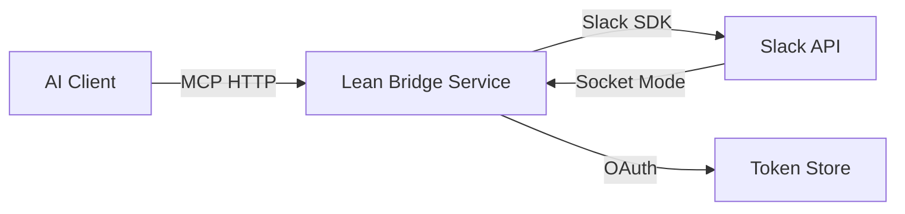

# Slack MCP集成技术方案 - 深度分析报告

**分析日期**: 2025-06-22  
**综合评级**: ⭐⭐⭐⭐⭐ (5/5星)  
**建议**: 强烈推荐实施

## MCP协议深度理解

### 核心机制验证
- MCP于2024年11月由Anthropic正式发布，已被OpenAI在2025年3月采用
- 采用**HTTP/REST**作为标准通信协议
- 三核心组件：Tools（AI控制的操作）、Resources（应用提供的上下文）、Prompts（用户触发的交互）
- **状态管理**：协议设计为无状态，AI客户端负责上下文维护

## Slack集成技术路径

### 2024年关键变化
- **强制现代化**：2024年6月后禁止创建传统Bot，必须使用现代Slack应用
- **严格限速**：2025年5月起非市场应用的`conversations.history`限制为**1请求/分钟，15条消息/请求**
- **Socket Mode vs Events API**：开发用Socket Mode，生产环境推荐HTTP Events API

### 推荐技术栈
```typescript
Express.js/FastAPI + Official Slack SDK + MCP SDK
├── MCP HTTP Server (接收AI请求)
├── Slack OAuth Handler (处理安装流程)
├── Slack SDK Client (API调用封装)
└── Event Handler (Socket Mode/HTTP Webhook)
```

## 技术架构设计

### "精简桥接"方案


### 核心组件
```javascript
// 单体服务，三层结构
┌─ MCP API Layer (Express路由)
├─ Service Layer (业务逻辑)
└─ Slack Client Layer (SDK封装 + 缓存)
```

## 官方推荐MCP生态

### 官方服务器矩阵
- **GitHub仓库**：`modelcontextprotocol/servers`包含参考实现
- **官方支持**：Google Drive、**Slack**、GitHub、Git、Postgres、Puppeteer、Stripe
- **社区实现**：`tuannvm/slack-mcp-client`、`sooperset/mcp-client-slackbot`

## 安全和权限管理

### 威胁模型与缓解
| 威胁 | 风险等级 | 缓解策略 |
|------|----------|----------|
| Token泄露 | **高危** | 专用密钥管理器(AWS Secrets Manager) |
| 权限升级 | **中危** | 最小权限原则 + OAuth范围限制 |
| 数据渗透 | **中危** | 限制工具集 + 访问日志 |
| DoS攻击 | **低危** | 请求限流 + 缓存策略 |

### 实用安全实现
```python
# 最小OAuth权限集
REQUIRED_SCOPES = [
    "chat:write",           # 发送消息
    "channels:read",        # 读取频道列表
    "users:read"           # 读取用户列表
]
```

## 开发复杂度评估

### 三阶段实施路径

**Phase 1 (1-2周)：基础工具**
- V1工具集：sendMessage, listChannels, listUsers
- 技术栈：Node.js + Express + @slack/bolt-js + MCP SDK
- 复杂度：**低** - 标准Web服务开发

**Phase 2 (2-3周)：OAuth与部署**
- OAuth 2.0流程实现
- Token安全存储
- 生产部署配置
- 复杂度：**中** - 涉及安全配置

**Phase 3 (3-4周)：高级功能**
- Block Kit UI模板
- 事件驱动响应
- 性能优化
- 复杂度：**中高** - 需要深度集成

## 性能考虑

### 当前Slack限制分析
- **chat.postMessage**: ~1消息/秒/频道，数百消息/分钟/工作区
- **一般API**: Tier 2 (20次/分钟) 到 Tier 4 (100+次/分钟)
- **历史消息**: 非市场应用降至1请求/分钟（2025年生效）

### 缓存策略
```javascript
const cache = {
    channels: { ttl: 10 * 60 * 1000 },  // 10分钟
    users: { ttl: 30 * 60 * 1000 },     // 30分钟
    messages: { ttl: 2 * 60 * 1000 }    // 2分钟
};
```

## 维护和扩展性

### 长期成本考虑（年化）
- **API变更适配**：~40小时/年（Slack + MCP协议更新）
- **安全更新**：~20小时/年（依赖更新、安全补丁）
- **功能扩展**：~80小时/年（新工具、优化）
- **运维监控**：~30小时/年（错误处理、性能调优）

### 扩展策略
```typescript
interface MCPProvider {
    getTools(): Tool[];
    getResources(): Resource[];
    handleRequest(request: MCPRequest): Promise<MCPResponse>;
}

class SlackProvider implements MCPProvider { /* ... */ }
class NotionProvider implements MCPProvider { /* ... */ }  // 未来扩展
```

## 最终技术建议

### 推荐方案：渐进式"精简桥接"
1. **立即可行**：使用Socket Mode + 最小工具集构建V1
2. **架构合理**：单体服务，三层分离，支持水平扩展
3. **安全优先**：从V1就实施完整安全策略
4. **性能务实**：重点关注缓存而非过早的异步优化

### 关键决策点
| 选择 | 推荐 | 原因 |
|------|------|------|
| 通信协议 | HTTP/REST | MCP标准，最大兼容性 |
| 事件接收 | Socket Mode → HTTP | 开发便利 → 生产稳定 |
| 状态管理 | 无状态桥接 | 简化架构，AI负责上下文 |
| 工具范围 | 读写基础操作 | 避免复杂UI映射 |
| 安全模型 | 最小权限 + 密钥管理 | 平衡安全与功能 |

**预期投入**：2-3名开发者，6-8周完成生产就绪版本，年维护成本约170工时。

这个方案平衡了理论完整性与实践可行性，为Slack-MCP集成提供了既安全又高效的技术路径。